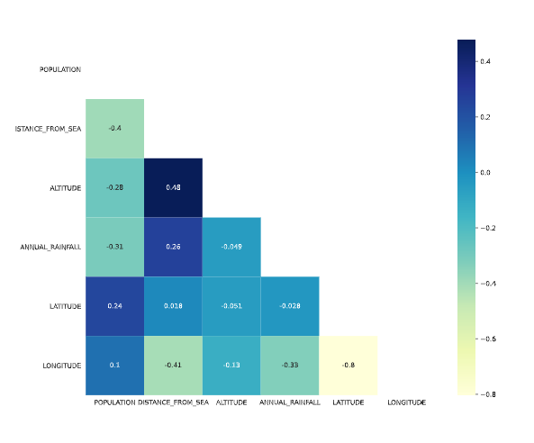
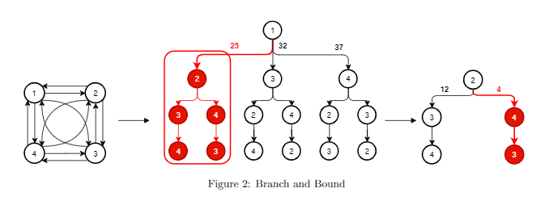

# A data-intelligent Secured framework towards smart flood rescue operation

**Implementation**

**1.** *Exploartory Data Analysis*

  
  
  

**2.** *Principal Component Analysis*

  
  

**3.** *Optimal K-value finding*

  
  
  

**4.** *K-means Clustering*

  
  

**5.** *A flood risk map using PCA, K-Means Algorithm and GIS.*

  
  

**6.** *Construct a shortest-path algorithm.*

**7.** *Derive a potential solution for a quicker flood rescue operation.*

