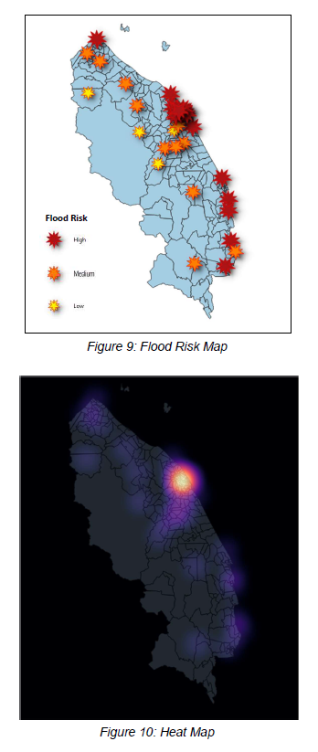
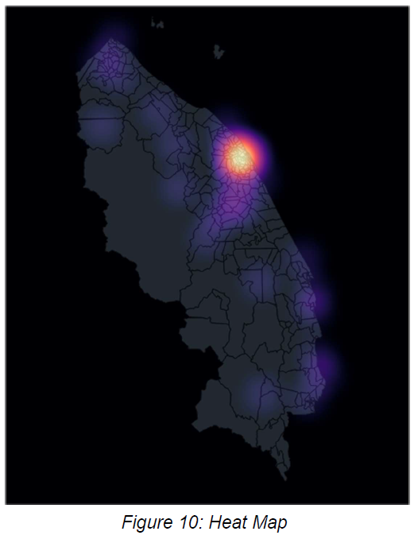

# GIS MAPPING AND SHORTEST-PATH ALGORITHM FOR DRONE-AIDED FLOOD RESCUE OPERATIONS

***Final Year Project***

**Problem Statement**

Current rescue operation techniques for floods are not always quick and efficient as they should be.

**Implementation**

*1. A flood risk map using PCA, K-Means Algorithm and GIS.*

*2. Predict flood risk using machine learning algorithm.*

*3. Construct a shortest-path algorithm.*

*4. Derive a potential solution for a quicker flood rescue operation.*

