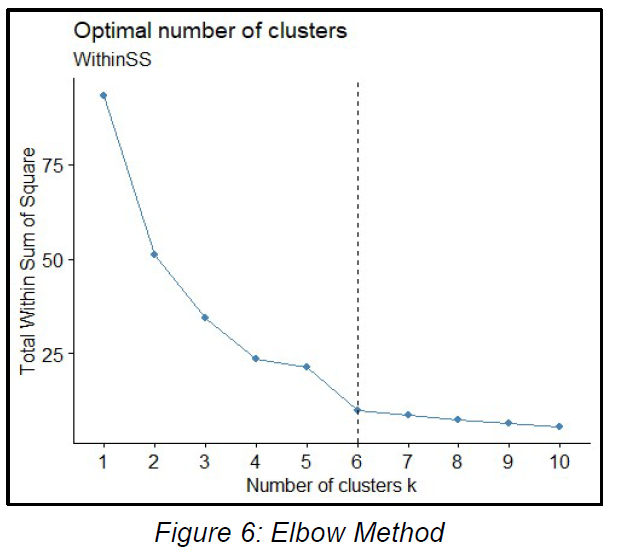

# Final Year Project

***Data-intelligent framework for smart flood rescue operation***

**Implementation**

*Exploartory Data Analysis*

  
  
  

*Principal Component Analysis*

  
  

*Optimal K-value finding*

  
  
  

*K-means Clustering*

  
  

*A flood risk map using PCA, K-Means Algorithm and GIS.*

  
  

* Construct a shortest-path algorithm.*

*Derive a potential solution for a quicker flood rescue operation.*

