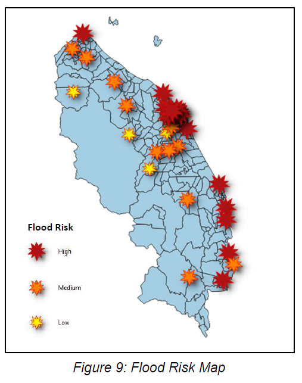

# Final Year Project

***Data-intelligent framework for smart flood rescue operation***

**Implementation**

*Exploartory Data Analysis*

  
  
  

*Principal Component Analysis*

  
  

*Optimal K-value finding*

  
  
  

*1. A flood risk map using PCA, K-Means Algorithm and GIS.*

*2. Predict flood risk using machine learning algorithm.*

*3. Construct a shortest-path algorithm.*

*4. Derive a potential solution for a quicker flood rescue operation.*

